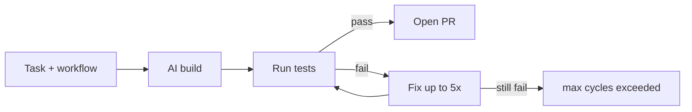

# Coffee Shop Backend +  Continuous Builder and tester

Express + TypeScript + Postgres. Schema and seed live in `schema.sql` and `seed.sql`.

## Local API

```bash
cp .env.example .env
# set DATABASE_URL (Postgres) and optional CURSOR_API_KEY
npm install
npm run db:setup
npm run dev
```

- API: http://localhost:3001
- Swagger UI: http://localhost:3001/docs
- ReDoc: http://localhost:3001/redoc

```bash
npm test
npm run validate:mcp
npm run harness
npm run harness:protect
```

Acceptance tests use in-memory Postgres (PGlite), not `DATABASE_URL`.

## Builder loop (demo flow)



1. Push the repo (includes `tasks/TASK-{id}.md` and `harness/acceptance/` tests).
2. GitHub: **Actions → Safi Continuous Builder → Run workflow**.
3. Set `task_id` (default **12** — ping demo; also try **11–15** for easy PRs).
4. Flow: **build → test → pass → PR**, or **fail → fix (max 5) → test → pass → PR**.

`TASK_ID` loads `tasks/TASK-{id}.md` automatically. No manual copy into `TASK.md`.

```bash
TASK_ID=11 npm run builder -- --no-pr   # local dry run
```

### Demo for senior review

| Step | Action |
|------|--------|
| 1 | Use `task_id: 12` (or 11–15) for a single-route demo |
| 2 | Run workflow on your feature branch |
| 3 | Watch `[builder]` logs: Building → Running tests → Fix cycle N → PR |
| 4 | On success, open the `prUrl` from the job log JSON |

**Success:**

```json
{ "status": "PASS", "cycles": 1, "prUrl": "https://github.com/.../pull/..." }
```

**Task already done (no PR):**

```json
{ "status": "PASS", "cycles": 0, "prSkipped": "task already implemented; nothing to commit" }
```

**Failed after 5 fix attempts:**

```json
{ "status": "FAIL", "cycles": 5, "reason": "max cycles exceeded, after 5 loop circle" }
```

### Builder outcomes

| Result | Meaning |
|--------|---------|
| `PASS` + `prUrl` | Tests passed, PR opened to `main` |
| `PASS` + `prSkipped` | Tests passed, nothing new to commit |
| `FAIL` + `cycles: 5` | Fix loop exhausted |
| `BLOCKED` | Triage reported `SPEC_AMBIGUITY` |
| `PROTECTED_PATH_VIOLATION` | Agent edited `TASK.md` or acceptance tests |

### Options

- `--no-pr` — local run without opening a PR
- `BUILDER_FULL_TESTS=1` — run full `npm test` instead of task-scoped tests
- `CURSOR_API_KEY` — required for the agent (local and CI)

Proof tasks: `tasks/TASK-01.md` through `TASK-15.md`.

**Easy PR demos** (single route, usually passes on first try):

| `task_id` | Endpoint | Response |
|-----------|----------|----------|
| 11 | `GET /health` | `{ "status": "ok", "service": "coffee-shop" }` |
| 12 | `GET /ping` | `{ "ping": "pong" }` |
| 13 | `GET /version` | `{ "version": "0.0.0" }` |
| 14 | `GET /info` | `{ "name": "coffee-shop", "api": "v1" }` |
| 15 | `GET /ready` | `{ "ready": true }` |

Run tasks **12–15** after **11** is merged (or pick any unimplemented task id) so the builder has product changes to commit and open a PR.
